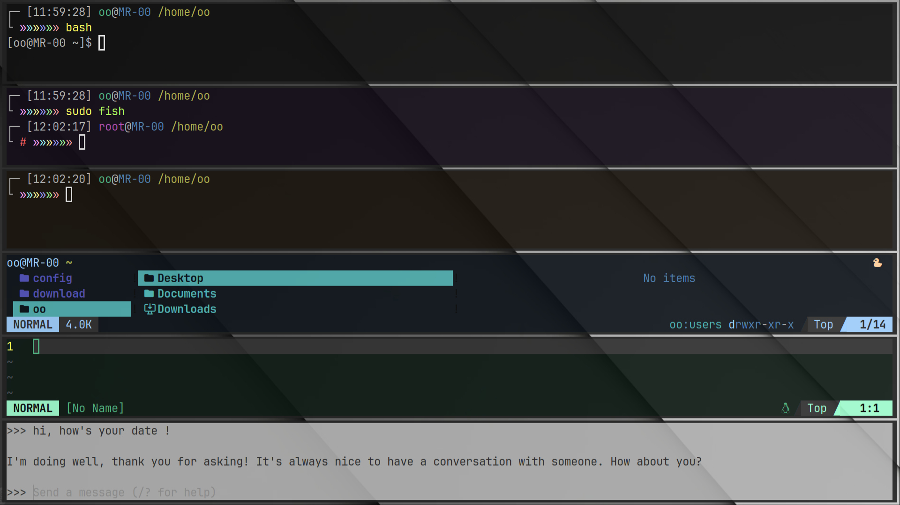
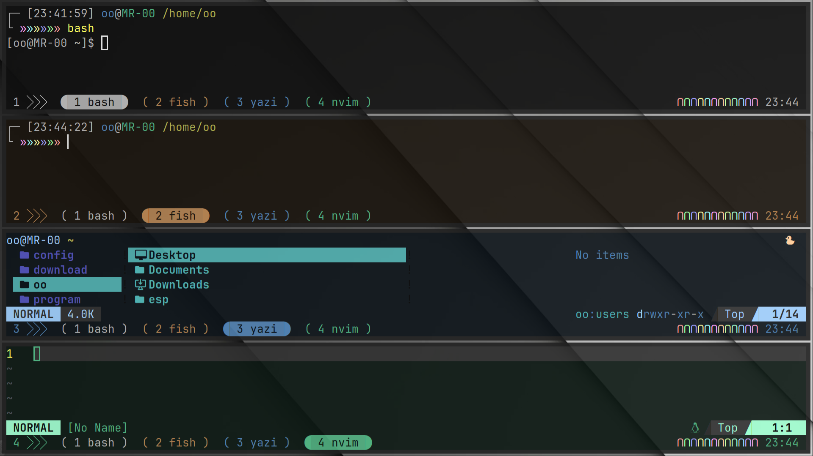

## Misty Colorful theme for tmux  

The color of tmux pane & status line change follows by the command you set.  

迷幻多彩主题。tmux 窗格和状态栏的颜色会根据你设置的命令而变化。  

-- single tab window     单标签窗口  
  

-- multi tab status line 多标签状态栏  
  

----  

### 📦 Installation 安装  

The path of the actual config file should be modified according to your own `tmux`.  
The following config file path base on `Arch Linux`.  

实际的配置文件的路径应该根据你自己的 `tmux` 进行修改。  
以下的配置文件的路经基于`Arch Linux`。  

#### Install manually 手动安装  

Clone the repo to your tmux config dir :  
```  
git clone https://github.com/ovwxxwvo/misty.tmux.git ~/.config/tmux/plugins/  
```  
Add this line to your yazi config file `~/.config/tmux/tmux.conf` :  
```  
source ~/.config/tmux/plugins/misty.tmux/init.tmux  
```  
Reload TMUX environment with:  
```  
tmux source ~/.config/tmux/tmux.conf  
```  

----  

### 🛠️ Configuration 配置  

You can create a file for configuration & source it :  
```sh  
mkdir ~/.config/tmux/config  
touch ~/.config/tmux/config/misty.tmux  
vi    ~/.config/tmux/config/misty.tmux  
```  
Add this line to your yazi config file `~/.config/tmux/tmux.conf` :  
```sh  
source ~/.config/tmux/config/misty.tmux  
```  

Or you can just directly modify the config file in the plugin :  
```sh  
vi ~/.config/tmux/plugins/misty.tmux/color.tmx  
vi ~/.config/tmux/plugins/misty.tmux/style.tmx  
```  

#### Configurations Options 配置选项  

There are quite a lot of configuration options.  
Maybe just pick the ones you need and modify them.  

有相当多的配置选项。也许你只挑选你需要的并进行修改。  

~/.config/tmux/plugins/misty.tmux/style.tmx  
```tmux  
set -g  @style_status_lt           ""  
set -g  @style_status_rt           "∩"  

set -g  @style_status_tab_actv_lt  ""  
set -g  @style_status_tab_actv_rt  ""  
set -g  @style_status_tab_pasv_lt  "("  
set -g  @style_status_tab_pasv_rt  ")"  


set -g  @style_blocked_cmds        "mpv"  
```  

~/.config/tmux/plugins/misty.tmux/color.tmx  
```tmux  
# set default color  
  set -g  @color_window_actv  "fg=#b0b0b0,bg=#101010"  
  set -g  @color_window_pasv  "fg=#505050,bg=#303030"  
  set -g  @color_border_actv  "fg=#d0d0d0,bg=#101010"  
  set -g  @color_border_pasv  "fg=#303030,bg=#303030"  
  set -g  @color_status_actv  "fg=#d0d0d0,bg=#101010"  
  set -g  @color_status_pasv  "fg=#b0b0b0,bg=#101010"  

# set command color  
  set -g  @color_cmd_window   "fg=#b0b0b0,bg=#101010"  
  set -g  @color_cmd_border   "fg=#d0d0d0,bg=#101010"  
  set -g  @color_cmd_status   "fg=#b0b0b0,bg=#101010"  
  set -g  @color_cmd_statlt   "fg=#b0b0b0,bg=#101010"  
  set -g  @color_cmd_statrt   "fg=#b0b0b0,bg=#101010"  
  set -g  @color_cmd_statfc   "fg=#b0b0b0,bg=#101010"  
  set -g  @color_cmd_statnf   "fg=#b0b0b0"  

# set color pallete  
  set -g  @color_re  "fg=#ffa0a0"  
  set -g  @color_gr  "fg=#a0ffa0"  
  set -g  @color_bl  "fg=#a0a0ff"  
  set -g  @color_ye  "fg=#ffffa0"  
  set -g  @color_cy  "fg=#a0ffff"  
  set -g  @color_ma  "fg=#ffa0ff"  
  set -g  @color_or  "fg=#ffd0a0"  
  set -g  @color_le  "fg=#d0ffa0"  
  set -g  @color_sg  "fg=#a0ffd0"  
  set -g  @color_sb  "fg=#a0d0ff"  
  set -g  @color_vi  "fg=#d0a0ff"  
  set -g  @color_pi  "fg=#ffa0d0"  

# window  border  status  statlt  statrt  statfc  statnf  
set -g  @cmd_clrs "\  
  \n\  
sudo \  
  #8050b0 #8030d0 #8050b0 #8050b0 #8050b0 #8050b0 #8050b0 \  
  #140d1a #140d1a #140d1a #140d1a #140d1a #140d1a  \  
  \n\  
fish \  
  #b08050 #d08030 #b08050 #b08050 #b08050 #b08050 #b08050 \  
  #1a140d #1a140d #1a140d #1a140d #1a140d #1a140d  \  
  \n\  
yazi \  
  #5080b0 #3080d0 #5080b0 #5080b0 #5080b0 #5080b0 #5080b0 \  
  #0d141a #0d141a #0d141a #0d141a #0d141a #0d141a  \  
  \n\  
nvim \  
  #50b080 #30d080 #50b080 #50b080 #50b080 #50b080 #50b080 \  
  #0d1a14 #0d1a14 #0d1a14 #0d1a14 #0d1a14 #0d1a14  \  
  \n\  
ollama \  
  #303030 #101010 #303030 #303030 #303030 #303030 #b0b0b0 \  
  #b0b0b0 #b0b0b0 #b0b0b0 #b0b0b0 #b0b0b0 #b0b0b0  \  
  \n\  
else \  
  #b0b0b0 #d0d0d0 #b0b0b0 #b0b0b0 #b0b0b0 #b0b0b0 #b0b0b0 \  
  #101010 #101010 #101010 #101010 #101010 #101010  \  
  \n\  
"  
```  

----  

### 📚 Suggestion 建议  

Your app, Your rule. Feel free to modify the files.  

& some suggestions for settings outside the plugin.  
- Maybe a gray-textured wallpaper will be better fit this.  
- Also a little transparency in the terminal emulator, about 80%|90%.  

& some personal preference settings inside the plugin, change it to your own.  
- dark  grey     `#101010` as the bg color for common commands.  
- dark  violet   `#140d1a` as the bg color for root,     like `sudo`.  
- dark  orange   `#1a140d` as the bg color for shell,    like `fish`.  
- dark  skyblue  `#0d141a` as the bg color for explorer, like `yazi`.  
- dark  seagreen `#0d1a14` as the bg color for editor,   like `nvim`.  
- light grey     `#b0b0b0` as the bg color for ai-tool,  like `ollama`.  

你的应用，你说了算。不要害怕修改文件。  

& 一些在插件之外的设定建议。  
- 也许一张灰色纹理的壁纸会更适配。  
- 且一点透明度在终端模拟器中，大约 80%|90%。  

& 一些在插件内部的个人喜好设定，更换为你的喜好。  
- 深灰色 `#101010` 作为普通命令的背景色。  
- 深紫色 `#140d1a` 作为高级用户   `sudo`   的背景色。  
- 深橙色 `#1a140d` 作为命令解析器 `fish`   的背景色。  
- 深天蓝 `#0d141a` 作为文件管理器 `yazi`   的背景色。  
- 深海绿 `#0d1a14` 作为文本编辑器 `nvim`   的背景色。  
- 浅灰色 `#b0b0b0` 作为智能工具集 `ollama` 的背景色。  

----  

### 📜 [MIT](LICENSE) License 许可证  


