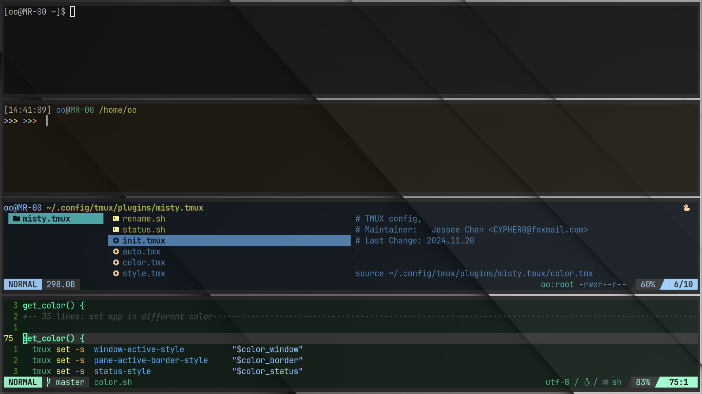

## Misty for tmux  

A misty colorful theme.  
The color of tmux pane & status change follows by the command you set.  

-- Global Preview  
  

Your app, Your rule. Feel free to modify the files.  
Some recommended settings outside of the plugin.  
Maybe a gray-toned, textured image bg will be better fit this.  
And set a little transparency in the terminal emulator.  

----  

### Installation  

The `nerd font` is depends on you.  

#### Manual (Recommended)  

**The path of the actual config file should be modified according to your own `tmux`.**  

Clone the repository to your tmux config dir :  
```  
git clone https://github.com/ovwxxwvo/misty-palette.git ~/.config/tmux/plugins/  
```  
Add this line to your tmux config file :  
```  
source ~/.config/tmux/plugins/misty.tmux/init.tmux  
```  
Reload TMUX environment with:  
```  
tmux source ~/.config/tmux/tmux.conf  
```  

----  

### Configurations  

You can create a file for configuration & source it :  
```  
mkdir ~/.config/tmux/config  
touch ~/.config/tmux/config/misty.tmux  
vi    ~/.config/tmux/config/misty.tmux  
```  
Add this line to your tmux config file :  
```  
source ~/.config/tmux/config/misty.tmux  
```  

Or you can just directly modify the config file in the plugin :  
```  
vi ~/.config/tmux/plugins/misty.tmux/color.tmx  
vi ~/.config/tmux/plugins/misty.tmux/style.tmx  
```  

#### Configurations Options  

There are quite a lot of configuration options.  
Maybe you just pick the ones you need and modify them.  

~/.config/tmux/plugins/misty.tmux/style.tmx  
```  
set -s  @style_status_lt           ""  
set -s  @style_status_rt           "∩"  

set -s  @style_status_tab_actv_lt  ""  
set -s  @style_status_tab_actv_rt  ""  
set -s  @style_status_tab_pasv_lt  "("  
set -s  @style_status_tab_pasv_rt  ")"  


set -g  @style_blocked_cmds        "mpv"  

set -g  @style_colorful_cmd1       "fish"  
set -g  @style_colorful_cmd2       "yazi"  
set -g  @style_colorful_cmd3       "nvim"  
```  

~/.config/tmux/plugins/misty.tmux/color.tmx  
```  
# set default color  
  set -s  @color_window_actv  "fg=#b0b0b0,bg=#101010"  
  set -s  @color_window_pasv  "fg=#505050,bg=#303030"  
  set -s  @color_border_actv  "fg=#d0d0d0,bg=#101010"  
  set -s  @color_border_pasv  "fg=#303030,bg=#303030"  
  set -s  @color_status_actv  "fg=#d0d0d0,bg=#101010"  
  set -s  @color_status_pasv  "fg=#b0b0b0,bg=#101010"  

# set command color others  
  set -s  @color_cmd0_window  "fg=#b0b0b0,bg=#101010"  
  set -s  @color_cmd0_border  "fg=#d0d0d0,bg=#101010"  
  set -s  @color_cmd0_status  "fg=#b0b0b0,bg=#101010"  
  set -s  @color_cmd0_statlt  "fg=#b0b0b0,bg=#101010"  
  set -s  @color_cmd0_statrt  "fg=#b0b0b0,bg=#101010"  
  set -s  @color_cmd0_statnf  "fg=#b0b0b0,bg=#101010"  
  set -s  @color_cmd0_statfc  "fg=#b0b0b0,bg=#101010"  

# set command color fish  
  set -s  @color_cmd1_window  "fg=#b08050,bg=#1a140d"  
  set -s  @color_cmd1_border  "fg=#d08030,bg=#201000"  
  set -s  @color_cmd1_status  "fg=#b08050,bg=#1a140d"  
  set -s  @color_cmd1_statlt  "fg=#b08050,bg=#1a140d"  
  set -s  @color_cmd1_statrt  "fg=#b08050,bg=#1a140d"  
  set -s  @color_cmd1_statnf  "fg=#b08050,bg=#1a140d"  
  set -s  @color_cmd1_statfc  "fg=#b08050,bg=#1a140d"  

# set command color yazi  
  set -s  @color_cmd2_window  "fg=#5080b0,bg=#0d141a"  
  set -s  @color_cmd2_border  "fg=#3080d0,bg=#001020"  
  set -s  @color_cmd2_status  "fg=#5080b0,bg=#0d141a"  
  set -s  @color_cmd2_statlt  "fg=#5080b0,bg=#0d141a"  
  set -s  @color_cmd2_statrt  "fg=#5080b0,bg=#0d141a"  
  set -s  @color_cmd2_statnf  "fg=#5080b0,bg=#0d141a"  
  set -s  @color_cmd2_statfc  "fg=#5080b0,bg=#0d141a"  

# set command color nvim  
  set -s  @color_cmd3_window  "fg=#50b080,bg=#0d1a14"  
  set -s  @color_cmd3_border  "fg=#30d080,bg=#002010"  
  set -s  @color_cmd3_status  "fg=#50b080,bg=#0d1a14"  
  set -s  @color_cmd3_statlt  "fg=#50b080,bg=#0d1a14"  
  set -s  @color_cmd3_statrt  "fg=#50b080,bg=#0d1a14"  
  set -s  @color_cmd3_statnf  "fg=#50b080,bg=#0d1a14"  
  set -s  @color_cmd3_statfc  "fg=#50b080,bg=#0d1a14"  

# set color pallete  
  set -s  @color_re  "fg=#ffa0a0"  
  set -s  @color_gr  "fg=#a0ffa0"  
  set -s  @color_bl  "fg=#a0a0ff"  
  set -s  @color_ye  "fg=#ffffa0"  
  set -s  @color_cy  "fg=#a0ffff"  
  set -s  @color_ma  "fg=#ffa0ff"  
  set -s  @color_or  "fg=#ffd0a0"  
  set -s  @color_le  "fg=#d0ffa0"  
  set -s  @color_sg  "fg=#a0ffd0"  
  set -s  @color_sb  "fg=#a0d0ff"  
  set -s  @color_vi  "fg=#d0a0ff"  
  set -s  @color_pi  "fg=#ffa0d0"  
```  

----  

### License  
[MIT](LICENSE)  


